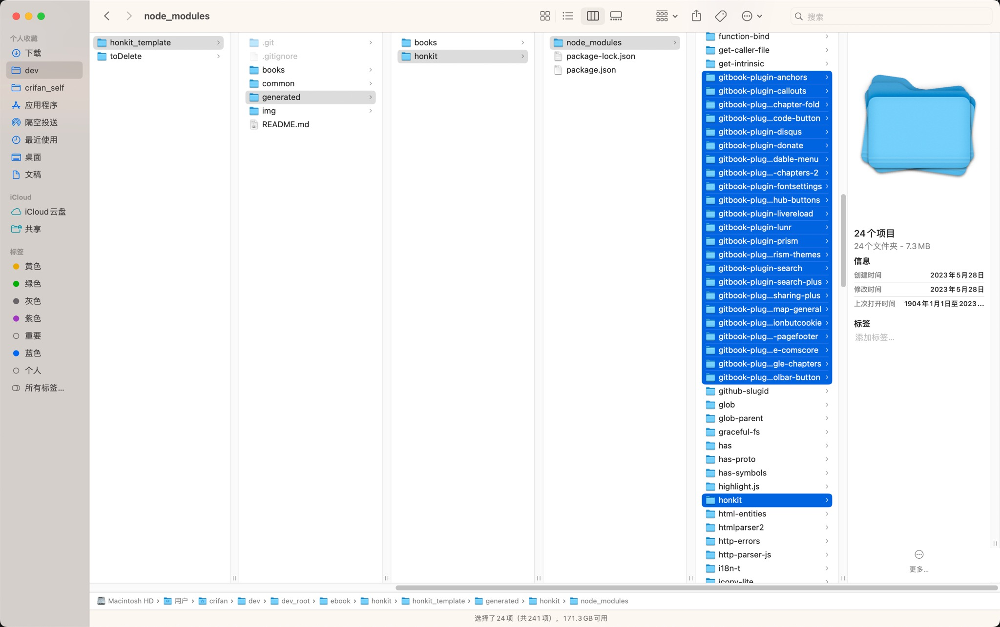
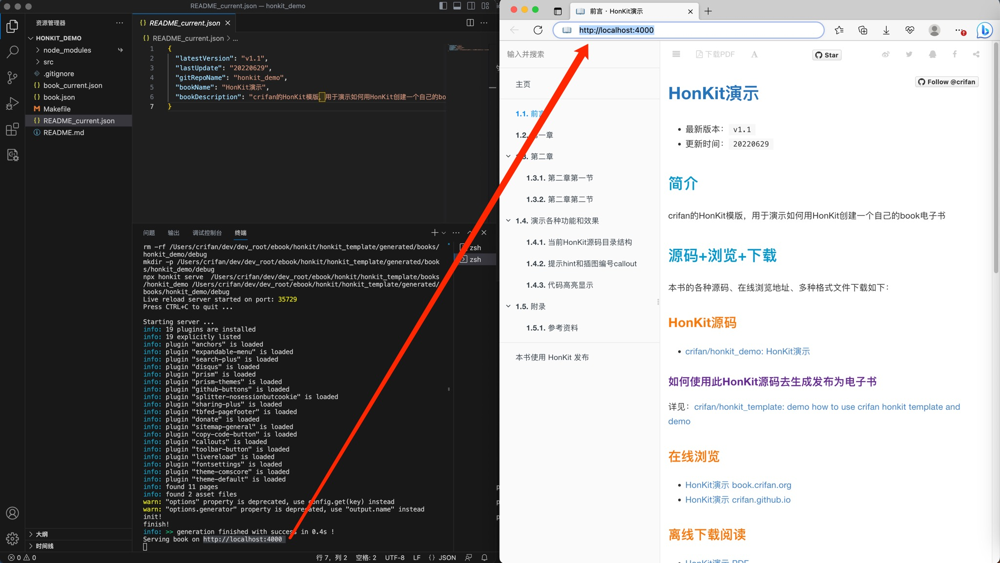
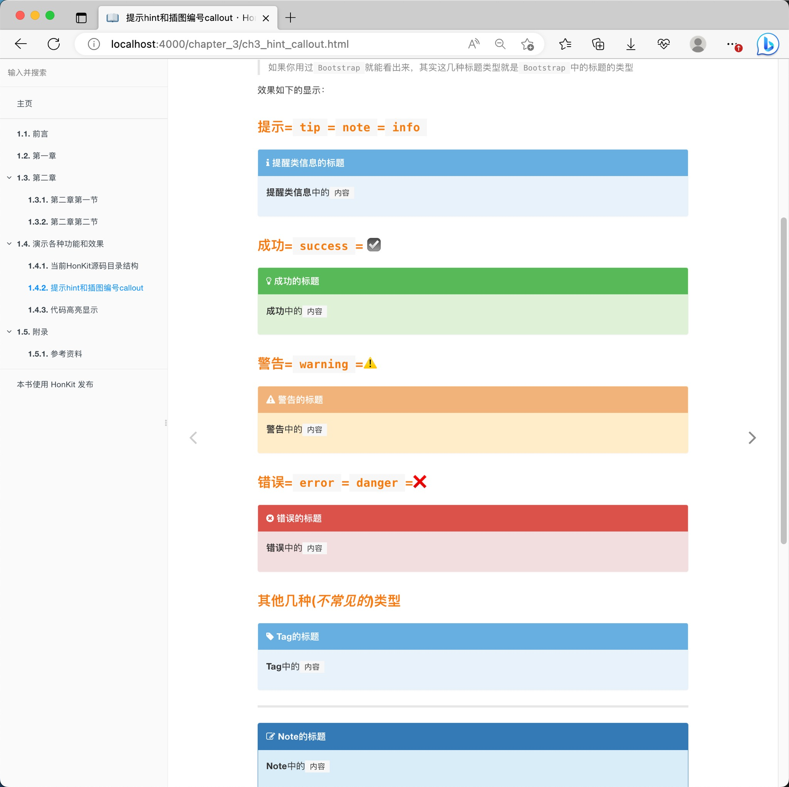
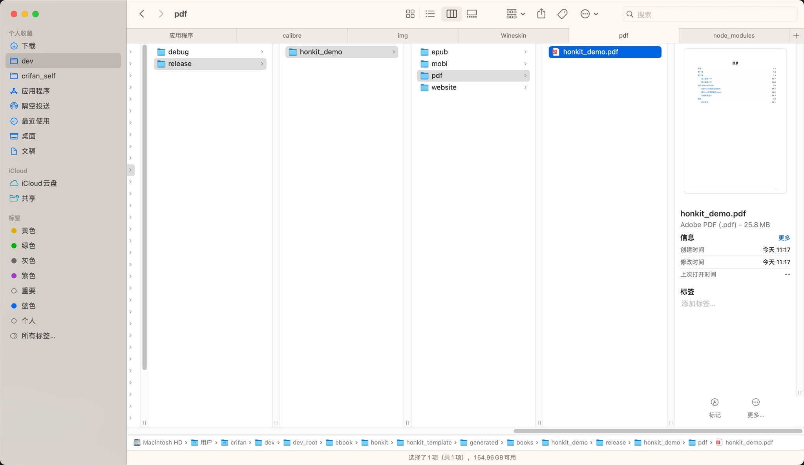

# HonKit模板

最后更新：`20241007`

## 项目代码仓库

[https://github.com/crifan/honkit_template](https://github.com/crifan/honkit_template)

## 项目作用

1. 用于演示如何使用`crifan`的[HonKit](https://github.com/honkit/honkit)模板
   * HonKit的模板，是基于之前的gitbook的模板更新而来的
     * [https://github.com/crifan/gitbook_template](https://github.com/crifan/gitbook_template)
2. 别人和自己，可以基于此模板，快速方便的创建出自己的`Honkit`电子书
   * Honkit可以理解为Gitbook的升级版
     * [Gitbook电子书](https://book.crifan.org/books/ebook_system_gitbook/website/)

## 项目结构

此项目主要包括：

* `各种工具`：主要是自己写的`Makefile`，用于自动化`honkit`的`初始化`、`调试`、`编译`、`提交`、`部署`等一系列过程以及相关配置或脚本工具
* `HonKit`的demo源码：写了个HonKit的demo的源码，供参考使用，用于创建一个自己的HonKit

总体目录结构和各自含义如下：

```bash
.
├── README.md
├── books
│   └── honkit_demo            # 基于template的honkit的demo
│       ├── Makefile            # 调用公共的Makefile
│       ├── README_current.json # 当前book的readme的部分，内部调用 common/tools/generate_readme_md.py 生成真正的 README.md
│       ├── book_current.json   # 当前book的book.json的部分，内部调用 common/tools/generate_book_json.py 生成完整的book.json
│       ├── node_modules -> ../../generated/honkit/node_modules   # 当前book编译时所依赖的js库，使用统一 generated/honkit/node_modules 的软链接即可，而无需每个book都重新安装一遍
│       └── src                 # 当前honkit的源码部分
│           ├── README.md       # 同步拷贝自 上级目录中生成的README.md
......
├── common
│   ├── config
│   │   ├── common
│   │   │   ├── common_book.json            # 所有book的共用部分，用于生成每个book的book.json
│   │   │   └── common_gitignore            # 所有book共用的gitignore，拷贝到每个book中重命名为.gitignore
│   │   ├── deploy                          # 和（编译后的pdf，html等）部署有关的内容
│   │   │   ├── deploy_ignore_book_list.txt # 如果想要部署时忽略某个book，可以把该book的名字加到这里
│   │   │   ├── deploy_server_info.mk       # 部署服务器相关信息，IP、用户、部署路径等
│   │   │   └── deploy_server_password.txt  # 部署服务器的密码，单独保存
│   │   └── template
│   │       └── template_README.md          # 所有book共用的README的模板，用于生成每个book的README.md
│   ├── honkit_makefile.mk                  # 所有book共用的Makefile
│   └── tools
│       ├── generate_book_json.py           # 脚本，用于从book_current.json和common_book.json生成每个book的book.json
│       ├── generate_md_from_summary.py     # 脚本，用于从src/SUMMARY.md中生成对应md文件（以及更新已有md文件的最后修改时间）
│       ├── generate_readme_md.py.py        # 脚本，用于从README_current.json获取配置信息，根据模板template_README.md，替换其中的{{xxx}}，去生成每个book的README.md
│       └── sync_ReadmeCurrent_to_bookCurrent.py  # 脚本，用于从README_current.json同步gitRepoName、bookName、bookDescription到book_current.json
│       └── update_crifan_github_io_readme.py  # 脚本，用于自动更新crifan的本地的github.io的README.md，更新最后更新日期和加上（如果缺失）当前book到honkit列表
├── generated                               # 所有后续工具生成的各种文件都放到这里
│   ├── books                               # 保存每个book生成的各种文件，包括pdf，html等等
│   └── honkit                              # 保存honkit生成的文件，目前只有共用的node_modules
├── img                                     # 保存此README.md说明文档所用到的图片
│   ├── honkit_debug_localhost.jpg
│   ├── honkit_generated_all_files_to_ouput_folder.jpg
│   ├── honkit_installed_plugin_node_modules.jpg
│   └── honkit_various_hint_callout_effect.jpg
```

## 为何会有这个模板？

之前自己用`Gitbook`创建了很多个`book`，为了更高效和统一管理，所以把公共部分提取出来，整理成模板：

[https://github.com/crifan/gitbook_template](https://github.com/crifan/gitbook_template)

而后来`Gitbook`官网已放弃维护`gitbook`，后续如继续使用，有无法正常更新和迁移困难的风险。

经过寻找替代品，最后找到了：[Honkit](https://github.com/honkit/honkit)，所以继续制作此Honkit的模板，供自己和别人参考使用。

## 使用步骤

简述：

* 首次初始化

```bash
git clone https://github.com/crifan/honkit_template.git

cd honkit_template

mkdir -p generated/books
mkdir -p generated/honkit

cd generated/honkit

## install Honkit
npm init --yes
npm install honkit --save-dev

# install js plugin: common and gitbook/honkit
npm install -s prismjs lodash 
npm install -s gitbook-plugin-anchors honkit-plugin-blockquote-callout gitbook-plugin-chapter-fold gitbook-plugin-copy-code-button gitbook-plugin-disqus gitbook-plugin-donate gitbook-plugin-expandable-menu gitbook-plugin-folding-chapters-2 gitbook-plugin-github-buttons honkit-plugin-prism gitbook-plugin-prism-themes gitbook-plugin-search-plus gitbook-plugin-sharing-plus gitbook-plugin-sitemap-general gitbook-plugin-splitter-nosessionbutcookie gitbook-plugin-tbfed-pagefooter gitbook-plugin-theme-comscore gitbook-plugin-toggle-chapters gitbook-plugin-toolbar-button
```

回到book：

```bash
cd ../../books/honkit_demo
```

然后即可正常调试单个book：

```bash
# make init

make debug

# make all

# make deploy
```

可以看到输出：

```bash
finish!
info: >> generation finished with success in 2.8s ! 
Serving book on http://localhost:4000
```

然后用浏览器去打开：

http://localhost:4000

即可看到自己的电子书内容了

* 之后每次book内部变化，只需要

```bash
make debug

make deploy
```

下面详细介绍，如何使用本`HonKit`模板，去创建一个自己的`book`

### 前提和准备

#### 已安装好HonKit

可以通过下面命令确认是否已安装好`HonKit`：

```bash
✗ npx honkit --version
6.0.0
```

### 下载模板源码

`git clone https://github.com/crifan/honkit_template.git`

------

### 首次初始化

安装Honkit插件：

```bash
cd honkit_template

mkdir -p generated/books
mkdir -p generated/honkit

cd generated/honkit

## install Honkit
npm init --yes
npm install honkit --save-dev

# install js plugin: common and gitbook/honkit
npm install -s prismjs lodash 
npm install -s gitbook-plugin-anchors honkit-plugin-blockquote-callout gitbook-plugin-chapter-fold gitbook-plugin-copy-code-button gitbook-plugin-disqus gitbook-plugin-donate gitbook-plugin-expandable-menu gitbook-plugin-folding-chapters-2 gitbook-plugin-github-buttons honkit-plugin-prism gitbook-plugin-prism-themes gitbook-plugin-search-plus gitbook-plugin-sharing-plus gitbook-plugin-sitemap-general gitbook-plugin-splitter-nosessionbutcookie gitbook-plugin-tbfed-pagefooter gitbook-plugin-theme-comscore gitbook-plugin-toggle-chapters gitbook-plugin-toolbar-button
```

安装后，`generated/honkit/node_modules`中有`Honkit`和对应的各种插件：



### 调试+编写`book`源码

回到单个book内：

```bash
cd honkit_template/books/honkit_demo/
```

去本地调试：

```bash
make debug
```

**作用**：内部会调用`npx honkit serve`去调试，把调试生成的文件都放到`generated/books/honkit_demo/debug`文件夹中。

然后就可以去用浏览器去打开：

[http://localhost:4000/](http://localhost:4000/)

看到此`honkit`模板demo的效果了：





然后就可以去用编辑器，比如[VSCode](https://book.crifan.org/books/best_editor_vscode/website/)，去编辑和更新自己的`markdown`=`md`源码了，然后honkit会自动检测到文件变动，热更新刷新页面。

### 生成静态文件：`html`,`pdf`,`epub`,`mobi`

```bash
make all
```

**作用**：内部会分别调用

* `npx honkit build`：生成**静态**`html`
* `npx honkit pdf`：生成`pdf`文件
* `npx honkit epub`：生成`epub`文件
* `npx honkit mobi`：生成`mobi`文件

生成的文件都保存到了`generated/books/honkit_demo/release/honkit_demo`文件夹中：



### [可选]提交`commit`+部署`deploy`

上述步骤中已经得到相关文件了，如果只想简单直接的发布到自己网站上，只需要拷贝和粘贴即可。

如果同时希望把此繁琐的人工操作自动化，则可以使用此处的工具：

```bash
make deploy
```

其中：`deploy` = `upload` + `commit`

去提交（git源码）并部署（把生成的`html`、`pdf`、`mobi`等文件上传）到自己的服务器上了

**注意**：`deploy`之前，需要修改相关信息为你自己的配置：

#### 对于`upload`

当然，如果自己没有`upload`的需求，则可以修改`common/honkit_makefile.mk`中的`deploy`的依赖：

```make
deploy: upload commit
```

改为：

```make
deploy: commit
```

即可去掉`upload`的动作。

#### 对于`commit`

对于：`common/honkit_makefile.mk`

如果自己没有需要commit的github.io的代码，则可以保持默认的：

`ENABLE_COMMIT_GITHUB_IO = false`

而不会去commit任何内容。

如果需要，则去改为true：

`ENABLE_COMMIT_GITHUB_IO = true`

以及更新为你自己的`github`本地文件路径，比如：

```make
GITHUB_IO_PATH=/Users/crifan/dev/dev_root/github/github.io/crifan.github.io
```

#### 对于`deploy`

* 修改部署服务器相关信息：
  * `common/config/deploy/deploy_server_info.mk`中的`IP`+`用户账号`+`文件上传路径`
  * `common/config/deploy/deploy_server_password.txt`中的`密码`

```make
DEPLOY_SERVER_IP=your_deploy_server_ip
DEPLOY_SERVER_USER=your_deploy_server_username
DEPLOY_SERVER_PATH=your_deploy_server_file_upload_path
```

和：
```make
your_server_password
```

比如我的是：

```make
DEPLOY_SERVER_IP=149.28.136.189
DEPLOY_SERVER_USER=root
DEPLOY_SERVER_PATH=/data/wwwroot/book.crifan.org/books
```

和

```make
xxxxxx
```

## 新建honkit

下面通过实际例子去介绍如何新建一个honkit：

切换到`books`目录下，去下载代码：

```bash
git clone https://github.com/crifan/python_common_code_snippet.git
```

切换到该目录下：

```bash
cd python_common_code_snippet
```

然后手动拷贝模板book`honkit_demo`中的所有内容到当前目录：

```bash
cp -a ../honkit_demo/* .
```

编辑`README_current.json`，更新你的版本号，文件描述，book的name等。

注：无需更新`book_current.json`，其`make debug`内部会自动更新。

再去同步更新内容：

```bash
make sync_content
```

其内部会：

* 同步`README_current.json`中的`gitRepoName`、`bookName`、`bookDescription`到`book_current.json`中的`repo`和`url`、`title`、`description`
* （用Python脚本根据模板）从`book_current.json`和`README_current.json`生成`book.json`和`README.md`
* 同步（拷贝）`README.md`到`src/README.md`

然后再去编辑自己的书的目录：`src/SUMMARY.md`

然后如果`SUMMARY.md`中目录较多，可以借助于脚本自动生成：

```bash
python ../../common/tools/generate_md_from_summary.py -e . -m summary
```

然后去：

```bash
make debug
```

注：其实（每次调试期间的）`make debug`内部也已经自动依赖和调用`make sync_content`了，以避免自己粗心，没有同步文件。

再去浏览器打开：

http://localhost:4000/

之后就是更新你的各种`md`文件内容了

如果一切正常，`Honkit`系统会自动检测到`md`文件的改动，触发重新编译，自动刷新页面内容。

最后内容完成后，再去：

```bash
make deploy
```

去发布，即可。

## 其他说明

### 备份的`honkit_node_modules.7z`

新增了`common/config/common/backup/honkit_node_modules.7z`，是本地Mac中已安装好的`generated/honkit/`的压缩包，包括`node_modules`和`package.json`

作用：万一，自己的或别人node_modules的环境被破坏了，或者想要换电脑但快速搭建`HonKit`环境，则可以快速的直接用此`honkit_node_modules.7z`，解压后移动到`generated/honkit`，即可。

### prism的alias支持

honkit的prism插件默认不支持alias

-> 会报错：

```bash
Failed to load prism syntax: objc
Error: Cannot find module 'prismjs/components/prism-objc.js'
...
  code: 'MODULE_NOT_FOUND',
```

想要支持alias，可以自己去加进去

举例：

加上：

* `oc`=`objectivec`
* `objc`=`objectivec`
* `asm`=`nasm`

变成：

`generated/honkit/node_modules/honkit-plugin-prism/index.js`

```js
var MAP_LANGUAGES = {
  'oc': 'objectivec',
  'objc': 'objectivec',
  'asm': 'nasm',
  'py': 'python',
  'js': 'javascript',
  'rb': 'ruby',
  'cs': 'csharp',
  'sh': 'bash',
  'html': 'markup'
};
```

Markdown代码中就可以用了：

``````md
```objc
...
```
``````

详见：

【已解决】Honkit中prism的语法高亮支持的语言

### 特殊处理：OnlyUseGithubIoBookList

如果想要对部分特殊的book：

只发布到github.io，而不发布到自己网站(book.crifan.org)中

则可以去更新：

* `common/tools/generate_readme_md.py`
* `common/tools/sync_ReadmeCurrent_to_bookCurrent.py`

中的：

```python
OnlyUseGithubIoBookList = [
  "scientific_network_summary",
]

BookRoot_crifan = "book.crifan.org/books"
BookRoot_github = "crifan.github.io"
```

更新为自己的book的repo的name即可。

### 根据SUMMARY.md自动生成和更新子md文件

已新增：`common/tools/generate_md_from_summary.py`

作用：

* 根据输入的`src/SUMMARY.md`的路径，自动更新对应book中的md文件
  * 如果已存在该md文件：更新最后修改时间
  * 如果不存在：新建该md文件

用法举例：

处于book的更目录，然后：

* update md
  * `python ../../common/tools/generate_md_from_summary.py -e .`
* generate md
  * `python ../../common/tools/generate_md_from_summary.py -e . -m summary`

### 给rsync添加代理以提速

此处用`rsync`同步上传文件到自己的github.io仓库中或自己的网站中时，有时候速度很慢

为了提速，可以考虑加代理。

此处`common/honkit_makefile.mk`中默认关闭了代理：

```makefile
ENABLE_RSYNC_PROXY = false
```

如果需要，可以去开启代理，且注意要改为你自己的代理的值，比如我自己的是：

```makefile
ENABLE_RSYNC_PROXY = true

ifeq ($(ENABLE_RSYNC_PROXY), true)
# for rsync use sock5 proxy
PROXY_SOCKS5 = 127.0.0.1:51837
RSYNC_PROXY = -e "ssh -o 'ProxyCommand nc -X 5 -x $(PROXY_SOCKS5) %h %p' -o ServerAliveInterval=30 -o ServerAliveCountMax=5
```

### 想要部署时忽略多个book中的某个book

如果你和我一样有个（实际上很少人会有这种）特殊需求，有多个book，想要在`make deploy`时，忽略某个book，则可以去：

编辑`common/config/deploy/deploy_ignore_book_list.txt`，然后加上要忽略部署上传的book，比如：

```bash
scientific_network_summary

```

### 此处的`book.json`和`REAMDME.md`是用脚本生成的

此处的`honkit_demo`的：

* `gibtook`的`book.json`
* `README.md`

是用脚本生成的：

* `Makefile`中的`generate_book_json`
  * 调用`common/tools/generate_book_json.py`去从
    * 共用部分`common/config/common/common_book.json`
    * 和当前book的`book_current.json`
  * 去生成的
* `Makefile`中的`generate_readme_md`
  * 调用`common/tools/generate_readme_md.py`去从
    * 模板`README_template.md`
    * 和当前book的`README_current.json`
  * 生成的

且相关的命令：

* `make init`
* `make debug`
* `make all`

会自动（依赖）调用`generate_book_json`去生成，而无需自己手动生成。

当然，想要自己生成，则可以运行：

* `make generate_book_json`
* `make generate_readme_md`

### `make clean_all`

任何时候，都可以用`make clean_all`去清除所有生成的文件，内部包含：

* 所有的生成的文件：`clean_generated_all`
* 本地debug调试目录：`clean_debug`
* 用于发布的文件：`clean_release`
  * 具体包含：`html`、`pdf`、`epub`、`mobi`

### `make help`

对于`Makefile`如果还有其他疑问，可以通过`make help`去查看说明：

```bash
➜  honkit_demo git:(main) ✗ make help
CURRENT_USER=crifan
NOT found  in IGNORE_FILE_CONTENT=
---Current Config---
ENABLE_COMMIT_GITHUB_IO=true
ENABLE_UPDATE_GITHUB_IO_README=true
ENABLE_DEPLOY_SERVER=true
ENABLE_RSYNC_PROXY=true
RSYNC_PROXY=-e "ssh -o 'ProxyCommand /usr/bin/nc -X 5 -x 127.0.0.1:51837 %h %p' -o ServerAliveInterval=30 -o ServerAliveCountMax=5"
RSYNC_PARAMS=-avzh --progress --stats --delete --force -e "ssh -o 'ProxyCommand /usr/bin/nc -X 5 -x 127.0.0.1:51837 %h %p' -o ServerAliveInterval=30 -o ServerAliveCountMax=5"
--------------------------------------------------------------------------------
Author  : crifan.org
Version : 20240927
Function: Auto use Honkit to generated files: website/pdf/epub/mobi; upload to remote server; commit to your github.io repository
                Run 'make help' to see usage
                Latest version: https://github.com/crifan/honkit_template
--------------------------------------------------------------------------------
CURRENT_DIR=/Users/crifan/dev/dev_root/ebook/honkit/honkit_template/books/honkit_demo
BOOK_NAME=honkit_demo

Usage:
  make <target>

Defaul Target: deploy

Targets:
  debug_include             Debug include file
  debug_dir                 Print current directory related info
  debug_python              Debug for makefile call python
  create_folder_debug       Create folder for honkit local debug
  create_folder_release     Create folder for honkit release: website+pdf+epub+mobi
  create_folder_website     Create folder for honkit website
  create_folder_pdf         Create folder for pdf
  create_folder_epub        Create folder for epub
  create_folder_mobi        Create folder for mobi
  create_folder_all         Create folder for all: debug+release(website/pdf/epub/mobi)
  clean_generated_book_json Clean generated book.json file
  clean_generated_readme_md Clean generated README.md file
  clean_gitignore           Clean copied .gitignore
  clean_generated_all       Clean generated all files
  clean_debug               Clean honkit debug
  clean_website             Clean generated honkit website whole folder
  clean_pdf                 Clean generated PDF file and whole folder
  clean_epub                Clean generated ePub file and whole folder
  clean_mobi                Clean generated Mobi file and whole folder
  clean_release             Clean honkit release
  clean_all                 Clean all generated files
  generate_readme_md        Generate README.md from ../README_template.md and README_current.json
  copy_readme               copy README.md to ./src
  copy_gitignore            copy common .gitignore
  sync_readme_to_book       Sync README_current.json to book_current.json
  generate_book_json        Generate book.json from ../book_common.json and book_current.json
  sync_content              sync content
  pull                      git pull to update to latest code
  status                    git status
  debug                     Debug honkit
  website                   Generate honkit website
  pdf                       Generate PDF file
  epub                      Generate ePub file
  mobi                      Generate Mobi file
  all                       Generate all files: website/pdf/epub/mobi
  upload                    Upload all genereted website/pdf/epub/mobi files to remote server using rsync. Create deploy_server_info.mk and deploy_server_password.txt which contain deploy server IP+User+Path and Password before use this
  commit                    Commit generated files to github io
  deploy                    Deploy = upload and commit for generated files
  help                      Show help
```
